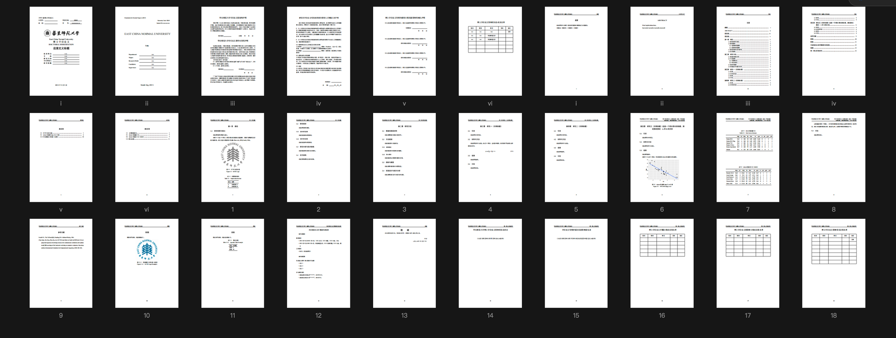
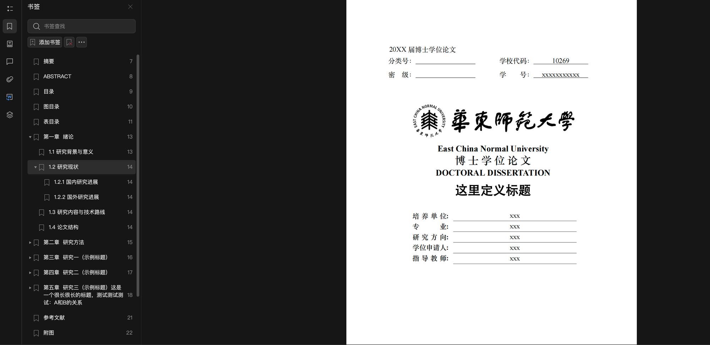
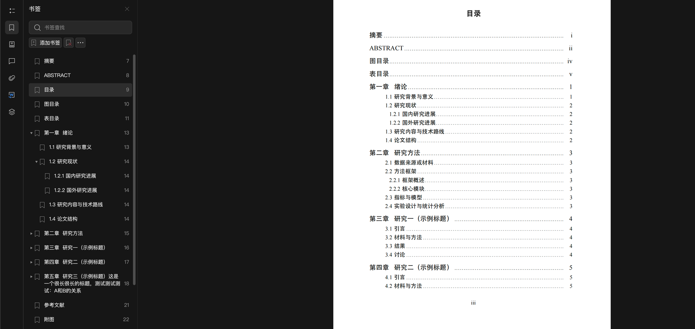
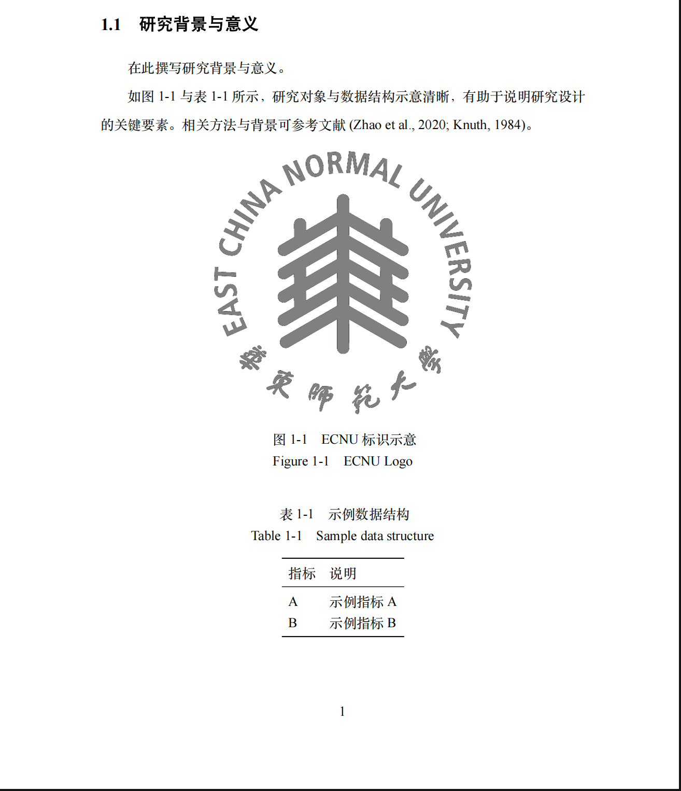
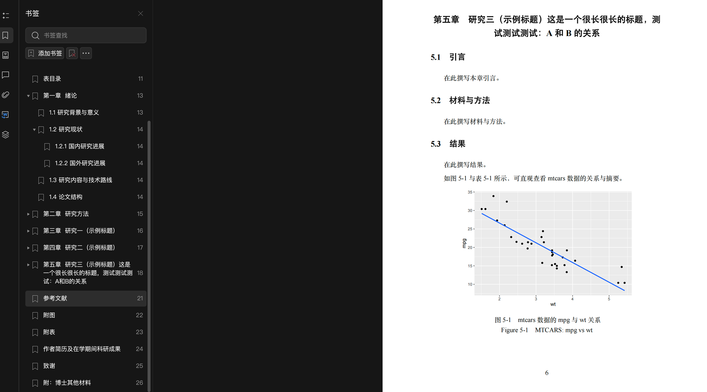
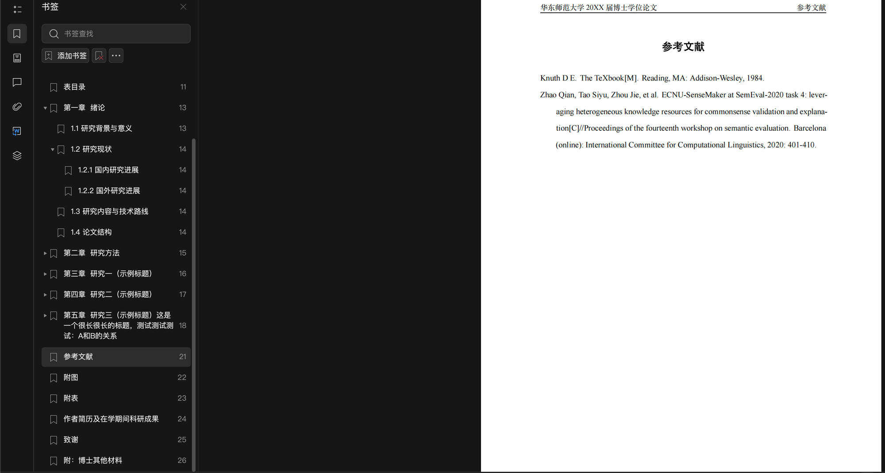
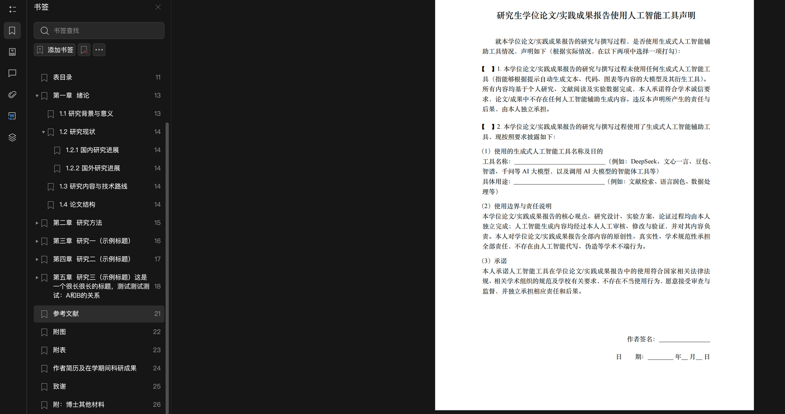

# ECNU 学位论文 Markdown 模板

本仓库用于在 Quarto 中直接写作并编译华东师范大学学位论文 PDF（XeLaTeX + ctexbook），复用 ECNU LaTeX 模板的封面/声明页、参考文献样式与目录/图表编号规范。

仓库提供 **硕士版**（`master/`）和 **博士版**（`doctoral/`）两个完全独立的 Quarto 子项目，两者结构对称、可分别编译，互不影响。

> 推荐使用方式：1. 可以先下载压缩文件到本地，手动添加 Git 管理， 2. 或者是 fork 到自己的仓库直接用 pull 到本地使用。
> 拉到本地，让 AI 帮你安装完依赖的环境。
> 搞定。
>
>（硕士你就用 **硕士版**（`master/`），博士你就**博士版**（`doctoral/`）。直接删掉另外一整个文件夹就行，如果你嫌烦的话）
>
> 做完以上，你就可以不用管任何参考文献格式，快乐的用 Markdown 写你的毕业论文。

渲染效果可直接查看仓库中的示例 PDF：[硕士版](master/_book/ECNU_thesis_xxx.pdf) | [博士版](doctoral/_book/ECNU_thesis_xxx.pdf)

**当前版本：v1.1**（更新于 2026 年 9 月 22 日）


## 渲染效果预览

以下截图取自博士版模板的实际渲染 PDF，硕士版结构相同。

### 全文总览

博士版完整页面缩略图，从封面到致谢一目了然：



### 封面与 PDF 书签

中文封面含校徽、论文类型、个人信息字段；左侧 PDF 书签自动生成带编号的章节大纲，支持三级标题导航：



### 目录（三级层级）

文字目录支持章（黑体四号）→ 节（黑体小四）→ 小节（黑体小四，缩进）三级显示，紧密点状引导线，页码超链接可跳转：



### 正文：图表引用与文献引用

图表按章自动编号（图 1-1、表 1-1），支持中英双语标题（bicaption）；文献引用采用著者-出版年格式：



### R 代码生成图表

chapter05 演示了直接在 QMD 中编写 R 代码块（ggplot2）生成图表并自动编号的效果：



### 参考文献

GB/T 7714 著者-出版年格式，英文在前中文在后，半角标点，隐藏 DOI/URL：



### AI 工具使用声明

2026 版新增的声明页，供打印后手动勾选签字：




## 功能清单

| 功能 | 说明 |
|------|------|
| 封面页 | 中文封面 + 英文封面，字段对齐、字号规范 |
| 声明页 | 原创性声明、著作权声明、AI 工具使用声明、导师审批页 |
| 答辩委员名单 | 表格格式，直接填写 |
| 目录系统 | 文字目录（3 级）+ 图目录 + 表目录，点状引导线、超链接跳转 |
| 章节编号 | 自动按章编号，标题字号分级（三号/小三/小四黑体） |
| 图表编号 | 按章自动编号（图 1-1、表 1-1），支持中英双语标题（bicaption） |
| 公式编号 | 按章自动编号（如 `(3-1)`），`equation` 居中、编号右对齐 |
| 参考文献 | GB/T 7714 著者-出版年格式，英文在前中文在后，半角标点，隐藏 DOI/URL |
| 页眉 | 左：学校+届别+论文类型；右：当前章名 |
| PDF 书签 | 自动生成带编号的书签大纲 |
| 后置页 | 科研成果/作者简历 + 致谢（博士版额外含补充材料页） |
| 页码 | 前置页罗马数字，正文阿拉伯数字 |


## 目录结构

```
├── master/                  # 硕士学位论文模板（独立 Quarto 项目）
├── doctoral/                # 博士学位论文模板（独立 Quarto 项目）
├── ecnu_notification_doc/   # 学校官方格式说明文档（参考，非模板代码）
└── README.md
```

`master/` 与 `doctoral/` 内部结构相同：

```
├── _quarto.yml              # Quarto 项目配置（书籍类型、PDF 输出、ctexbook 文档类）
├── index.qmd                # 中英文摘要 + 目录/图目录/表目录的排版设置
├── chapters/                # 正文各章，一章一个文件
│   ├── chapter01.qmd
│   ├── chapter02.qmd
│   └── ...
├── references.qmd           # 参考文献页面（手动调用 \bibliography）
├── references.bib           # 参考文献数据（BibTeX 格式）
├── gbt7714-ecnu.bst         # 自定义参考文献样式（英文在前中文在后）
├── gbt7714ctl.bib           # BST 格式控制条目（年份位置、标点、隐藏 DOI/URL）
├── tex/
│   ├── preamble.tex          # 全局设置：页眉、字体、目录样式、图表公式编号、封面变量
│   ├── before-body.tex       # 封面 + 声明页加载顺序
│   ├── after-body.tex        # 后置页加载顺序
│   ├── acknowledgement.tex   # 致谢内容
│   ├── achievements.tex      # （硕士）科研成果 / author-resume.tex（博士）作者简历
│   └── ecnu/                 # 学校要求的独立页面
│       ├── A1-COVER-1.tex    # 中文封面
│       ├── A2-COVER-E.tex    # 英文封面
│       ├── A3-COPYRIGHT.tex  # 原创性声明 + 著作权声明
│       ├── A4-AI-DECLARATION.tex  # AI 工具使用声明
│       ├── A5-ADVISOR-APPROVAL.tex # 导师审批页
│       ├── A6-MEMBERLIST.tex # 答辩委员名单
│       └── A7-SUPPLEMENTARY.tex   # （仅博士）补充材料占位页
└── fig/                      # 图片资源
```

> `include-before-body` / `include-after-body` 是 Quarto/Pandoc 的标准机制，分别对应 `\begin{document}` 之后、`\end{document}` 之前两个固定插入点，与 `index.qmd` 在 `book.chapters` 列表中的位置无关；调整 `before-body.tex`/`after-body.tex` 内 `\input` 的先后顺序即可控制前置页/后置页的排列顺序。

### 前置页顺序（硕士版、博士版相同）

1. 中文封面 → 2. 英文封面 → 3. 原创性声明 + 著作权声明 → 4. AI 工具使用声明 → 5. 导师和指导小组同意答辩确认声明 → 6. 答辩委员名单

### 后置页（硕士版与博士版不同，按各自要求配置）

- **硕士版**：发表论文和科研情况（`tex/achievements.tex`）→ 致谢（`tex/acknowledgement.tex`）
- **博士版**：作者简历及在学期间科研成果（`tex/author-resume.tex`）→ 致谢（`tex/acknowledgement.tex`）→ 附：博士其他材料——答辩决议、导师评阅表、开题/预答辩/答辩签名单占位页（`tex/ecnu/A7-SUPPLEMENTARY.tex`）


## 你需要修改的文件（操作模板）

拿到模板后，按以下清单逐一修改即可。所有占位内容都用 `xxx`、`~` 或中文提示标注。

### 1. 论文标题（`tex/preamble.tex` 末尾）

```latex
\def\thesisTitle{你的论文标题（可手动换行用 \\）}
\def\thesisTitleNoWrap{你的论文标题（不换行版本，用于原创性声明）}
\def\thesisETitle{Your English Title}
```

### 2. 页眉信息（`tex/preamble.tex` 约第 93 行）

```latex
\fancyhead[L]{\small\parbox[t]{0.45\textwidth}{\raggedright 华东师范大学2026届硕士学位论文}}
```
将 `2026` 改为你的毕业届别，`硕士` 改为 `博士`（如适用）。

### 3. 中文封面（`tex/ecnu/A1-COVER-1.tex`）

需要修改的内容：
- **届别与论文类型**：第 4 行 `2026 届硕士专业学位研究生学位论文`
- **学号**：第 19 行 `511945060xx`
- **学位类型**：第 31 行 `硕~士~专~业~学~位~论~文`（按实际类型修改）
- **封面字段**：约第 59–63 行，填写培养单位、专业、研究方向、姓名、导师
- **日期**：第 78 行 `2026年6月10日`

> 盲审时需注释掉姓名、导师、学号等个人信息，文件中有注释提示。

### 4. 英文封面（`tex/ecnu/A2-COVER-E.tex`）

需要修改的内容：
- **届别**：第 5 行 `Dissertation for Master's Degree in 2026`
- **学号**：第 10 行
- **封面字段**：约第 32–36 行，填写 Department、Major、Research Field、Candidate、Supervisor
- **日期**：第 43 行 `June 10, 2026`

### 5. 答辩委员名单（`tex/ecnu/A6-MEMBERLIST.tex`）

在表格中填写答辩委员的姓名、职称、单位。

### 6. 摘要与关键词（`index.qmd`）

替换中英文摘要正文和关键词。

### 7. 正文章节（`chapters/chapter01.qmd` 等）

- 直接用 Markdown 撰写，`#` 为章标题、`##` 为节标题、`###` 为小节标题
- **新增章节**时需同步在 `_quarto.yml` 的 `book.chapters` 列表中登记
- **删除章节**时同样需要从列表中移除

### 8. 参考文献（`references.bib`）

将你的文献条目添加到 `references.bib` 中。正文中用 `[@citekey]` 或 `[@key1; @key2]` 引用。

### 9. 致谢（`tex/acknowledgement.tex`）

替换致谢正文、署名和日期。

### 10. 科研成果

- **硕士版**：编辑 `tex/achievements.tex`，填写已发表论文、专利、比赛等
- **博士版**：编辑 `tex/author-resume.tex`，填写个人简历和科研成果

### 11. AI 工具使用声明（`tex/ecnu/A4-AI-DECLARATION.tex`）

根据实际情况选择"未使用"或"已使用"，如选"已使用"则填写工具名称和用途。此页为打印后手动勾选签字。


## 使用方法

1. 进入对应版本目录：`cd master` 或 `cd doctoral`
2. 按上方"你需要修改的文件"清单填写个人信息
3. 撰写摘要：`index.qmd`
4. 撰写正文：`chapters/chapter01.qmd` 等，新增章节需同步在 `_quarto.yml` 的 `book.chapters` 列表中登记
5. 插入图片（中英双语标题）：

   ```latex
   \begin{figure}[htbp]
   \centering
   \includegraphics[width=0.8\linewidth]{fig/your-image.pdf}
   \bicaption{中文图标题}{English caption}
   \label{fig-your-label}
   \end{figure}
   ```

6. 插入表格（中英双语标题）：

   ```latex
   \begin{table}[htbp]
   \centering
   \bicaption{中文表标题}{English caption}
   \label{tbl-your-label}
   \begin{tabular}{ll}
   \toprule
   列1 & 列2 \\
   \midrule
   数据 & 数据 \\
   \bottomrule
   \end{tabular}
   \end{table}
   ```

7. 插入公式：使用 Quarto 数学语法并加 label 即可自动按章节编号（如第三章第一个公式自动生成 `(3-1)`）：

   ```markdown
   $$
   y = \beta_0 + \beta_1 x + \epsilon
   $$ {#eq-example}
   ```

8. 引用文献：

   ```markdown
   如文献[@zhao-etal-2020-ecnu]所示……
   多篇引用[@key1; @key2; @key3]。
   ```

9. 渲染 PDF：

   ```bash
   quarto render                        # 渲染整本书
   quarto render chapters/chapter03.qmd # 仅渲染单章，便于快速预览
   ```

渲染结果位于各自目录下的 `_book/`（已在 `.gitignore` 中忽略，不要提交）。


## 参考文献格式说明

本模板使用自定义的 `gbt7714-ecnu.bst`（基于 `gbt7714-author-year.bst` v3.1.0），配合 `gbt7714ctl.bib` 控制条目，实现以下效果：

| 效果 | 实现方式 |
|------|----------|
| 英文在前中文在后 | BST 中修改 `lang.*.order` 排序值 |
| 年份在期刊名后面 | `CTL_year_before_title = {false}` |
| 半角英文标点 | `CTL_bib_punct = {half}` |
| 隐藏 DOI/URL | `CTL_doi = {false}`, `CTL_url = {false}` |
| `[J/OL]` 变 `[J]` | 隐藏 URL/DOI 后 BST 自动不追加 `/OL` |

如需调整（如显示 DOI、改回全角标点），编辑 `gbt7714ctl.bib` 中对应的 `CTL_*` 选项即可。


## 环境要求

- [Quarto](https://quarto.org/)
- TeX Live（含 `ctex` 宏包）与 XeLaTeX，缺包时可用 `tlmgr install <package>` 补齐
- R（仅当使用 R 代码块生成图表时需要，如 chapter05 中的 ggplot2 示例）


## 版本历史

### v1.1（2026-09-22）

- **参考文献样式升级**：新增自定义 `gbt7714-ecnu.bst`（英文排前中文排后），配合独立的 `gbt7714ctl.bib` 控制条目（隐藏 DOI/URL、半角标点），取代原先嵌入 `references.bib` 的控制条目
- **三级标题示例**：chapter01 和 chapter02 新增 `###` 小节标题，展示目录三级层级渲染效果
- **README 完善**：新增功能清单、"你需要修改的文件"操作模板、参考文献格式说明、图表/公式插入示例

### v1.0（2026-09-22）

#### 封面与格式优化

- **中文封面字段**：改为「培养单位 / 专业 / 研究方向 / 学位申请人 / 指导教师」，加粗、冒号对齐（`\makebox[5em][s]` + `\hfill`）
- **英文封面字段**：改为四号加粗（`\sihao\bfseries`）
- **硕士封面英文校名**：修复 xeCJK 吞空格导致的 "EastChinaNormalUniversity" 问题（改用 `\fontspec{Times New Roman}` 切换字体）

#### 参考文献

- **年份位置**：通过 `@gbt7714bstctl` 控制条目设置 `CTL_year_before_title = {false}`，将年份从作者后移到期刊/出版者后
- **标点风格**：设置 `CTL_bib_punct = {half}`，统一使用半角（英文）标点
- **旧版 BST 清理**：删除 `GBT7714-2005.bst` 和 `GBT7714-2005NLang.bst`

#### 历史版本改动

在硕士/博士双版本拆分的基础上，前一版本重点修复了目录、图表目录与 PDF 书签的排版细节：

- **目录（TOC）层级区分**：一级条目（章）黑体四号、二级及以下（节/小节）黑体小四，一级条目前增加段前间距，使章节层级在视觉上更清晰；字号统一改用 ctex 原生的 `\zihao` 命令而非手写 `\fontsize`，避免中文字号不随设置变化的问题
- **黑体粗细修复**：优先将 ctex 的 `\heiti` 映射到官方参考 PDF 使用的「SimHei」；缺失时回退到「STHeiti」并设置 `AutoFakeBold=2`，最终回退到「Heiti SC Medium」。各分支显式设置 `Scale=1`，用于消除 ctex/fontspec 对黑体字体度量的额外缩放
- **会议论文参考文献**：参考文献中出现的 `[C]//Proceedings...` 是 `gbt7714-author-year` 按 GB/T 7714 对 `@inproceedings` 条目生成的有意分隔符，并非 `.bib` 中重复输入的两个斜杠；无需修改 `.bib` 或 `.bst`
- **目录点状引导线**：由稀疏的点线（点间距 9.5pt）改为紧密点线（4pt），贴近学校模板视觉效果
- **图目录/表目录**：去除不同章节之间的多余间距；修复超链接跳转位置错误的问题
- **PDF 书签（大纲）**：目录标题补充书签锚点；开启 `bookmarksnumbered`，书签自动带上章节编号
- **公式编号**：新增按章节自动编号支持（如 `(3-1)`），计数器随 `\chapter` 自动重置
- **摘要标题**：英文摘要标题由 `Abstract` 改为大写 `ABSTRACT`
- **`.gitignore`**：忽略各子项目渲染生成的顶层 `.tex`（`keep-tex: true` 产物）与 `.DS_Store`
