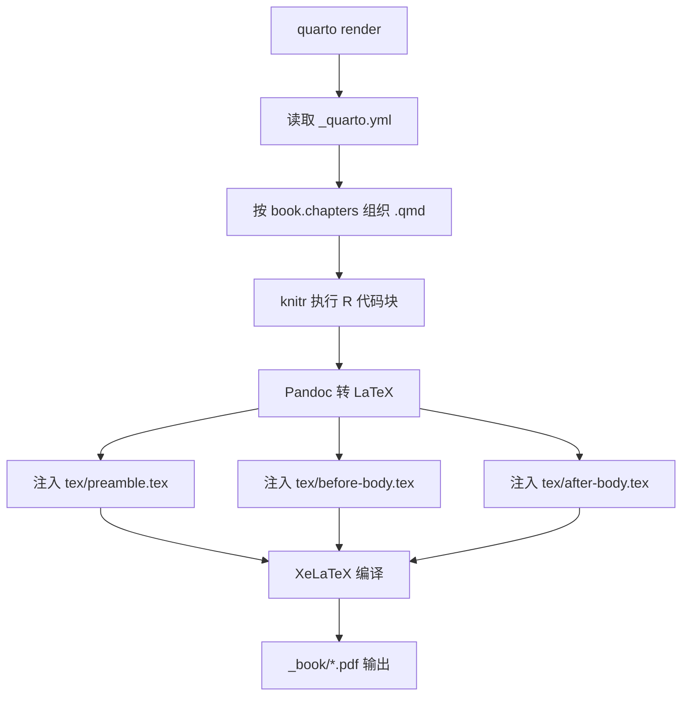

# Quarto -> PDF 渲染流程（本项目版）

本文档描述本项目从 `quarto render` 到最终 PDF 的整合流程，并记录关键文件的职责与打印模式开关。内容为中文说明，便于后续查阅与打印前切换。

## 总体流程（概览）
- Quarto 根据 `_quarto.yml` 读取章节列表与格式配置。
- knitr 执行 QMD 内的 R 代码块，生成中间 Markdown。
- Pandoc 把中间 Markdown 转成 LaTeX，并注入 `include-in-header` / `include-before-body` / `include-after-body`。
- XeLaTeX 编译多次生成最终 PDF。



## 关键文件与职责
- `_quarto.yml`  
  - `project.type: book` 进入书籍模式。
  - `book.chapters` 决定章节顺序（`index.qmd` + `chapters/*.qmd`）。
  - `format.pdf` 决定引擎、引用样式、注入文件等。
- `tex/preamble.tex`  
  - 全局 LaTeX 设置中心：字体、版芯、页眉、图表编号、bicaption、引用样式覆盖、打印模式开关等。
- `tex/before-body.tex`  
  - 封面/声明页插入（`tex/ecnu/*.tex`）。
  - 前置页页码样式与章节格式。
- `index.qmd`  
  - 摘要/Abstract（不编号）。
  - 目录/图目录/表目录的插入与页码切换。
- `chapters/*.qmd`  
  - 正文章节内容。
  - 图表与 R 代码块（ggplot2、kable）等。

## 目录/摘要/正文的拼装顺序
1) `tex/before-body.tex` 插入封面与前置页。  
2) `index.qmd` 输出摘要与 Abstract（`.unnumbered`，不显示“第一章”）。  
3) `index.qmd` 内 LaTeX 块插入目录/图目录/表目录，并切换为阿拉伯页码。  
4) `chapters/*.qmd` 输出正文，从第一章开始编号。  

## 打印模式开关
打印模式默认关闭，不影响电子版。开启后自动：
- 切换为双面（twoside）逻辑。
- 章节切页使用 `\cleardoublepage`，自动补空白页。
- 偶数页版心镜像（左右边距互换）。

在 `tex/preamble.tex` 中：
```tex
% \def\PrintMode{}
\ifdefined\PrintMode
  \def\SideMode{twoside}
  \def\ClearPageStyle{\cleardoublepage}
  \makeatletter\@twosidetrue\makeatother
\else
  \def\SideMode{oneside}
  \def\ClearPageStyle{\clearpage}
  \makeatletter
  \@twosidefalse
  \let\cleardoublepage\clearpage
  \makeatother
\fi
```

版心镜像逻辑（仅打印模式启用）：
```tex
\ifdefined\PrintMode
  \setlength{\evensidemargin}{\dimexpr\paperwidth-\textwidth-2in-\oddsidemargin\relax}
\else
  \setlength{\evensidemargin}{\oddsidemargin}
\fi
```

切页使用 `\ClearPageStyle`（电子版不补空白页，打印版自动补）。

## 图表编号（按章 1-1）
在 `tex/preamble.tex` 中：
```tex
\@addtoreset{figure}{chapter}
\@addtoreset{table}{chapter}
\renewcommand{\thefigure}{\thechapter-\arabic{figure}}
\renewcommand{\thetable}{\thechapter-\arabic{table}}
```

## 双语图表（bicaption）
使用原生 LaTeX 环境以支持双语标题：
```tex
\begin{figure}[htbp]
\centering
\includegraphics[width=0.6\linewidth]{fig/xxx.pdf}
\bicaption{中文标题}{English Title}
\label{fig-xxx}
\end{figure}
```

表格使用 `results: asis` 输出 LaTeX（示例）：
```{r}
#| echo: false
#| message: false
#| warning: false
#| results: asis
tbl <- knitr::kable(head(mtcars, 6), format = "latex", booktabs = TRUE)
cat("\\begin{table}[htbp]\n\\centering\n")
cat("\\bicaption{中文}{English}\n")
cat("\\label{tbl-xxx}\n")
cat(tbl)
cat("\n\\end{table}\n")
```

## 参考文献与引用
在 `_quarto.yml` 中：
- `cite-method: natbib`
- `natbiboptions: "authoryear,round"`
- `biblio-style: plainnat`

效果：
- 文内引用为作者-年份格式。
- 文末参考文献为 plainnat 风格。

如果要参考文献为数字，引用是序号，可以改为：

- `biblio-style: GBT7714-2005`

## 输出位置
默认输出：`_book/*.pdf`  
如需临时输出，可用 `quarto render --output-dir <dir>`（这是调试用，不是配置项）。

